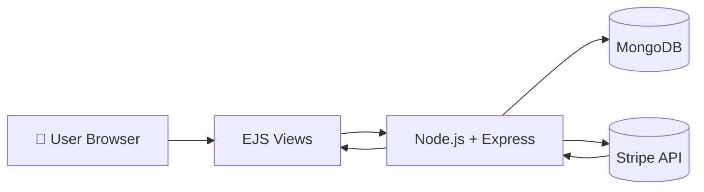
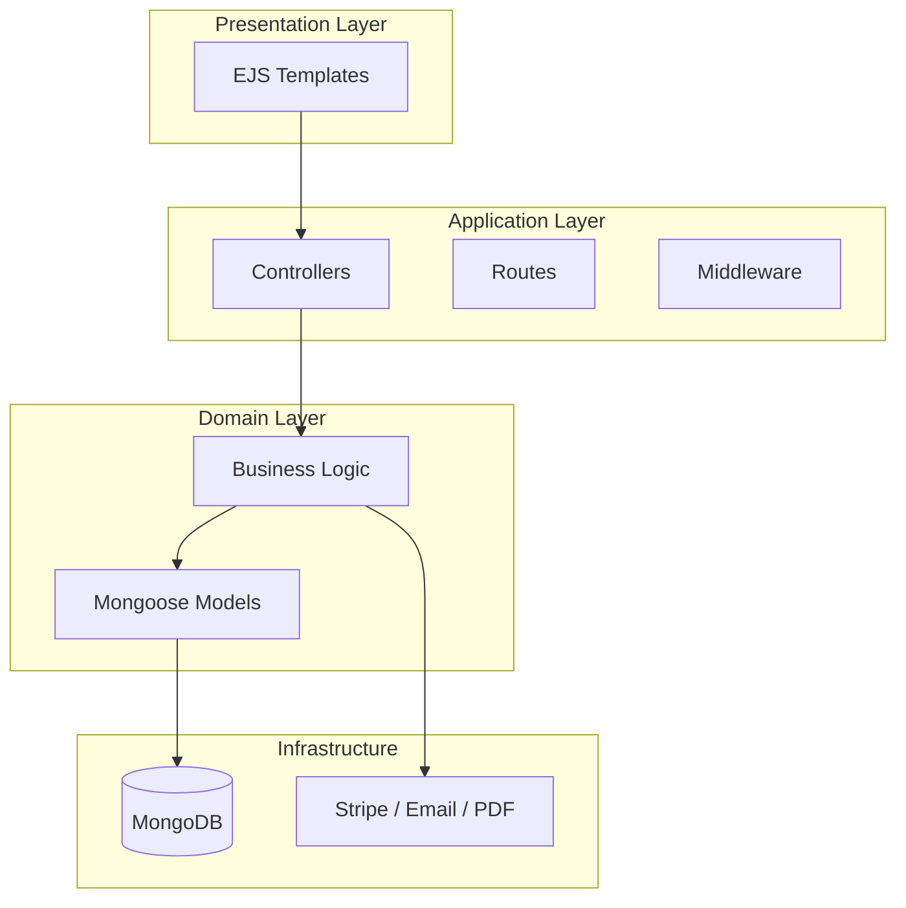
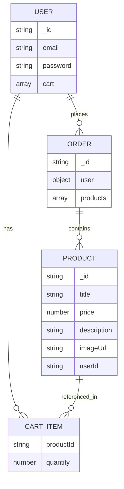
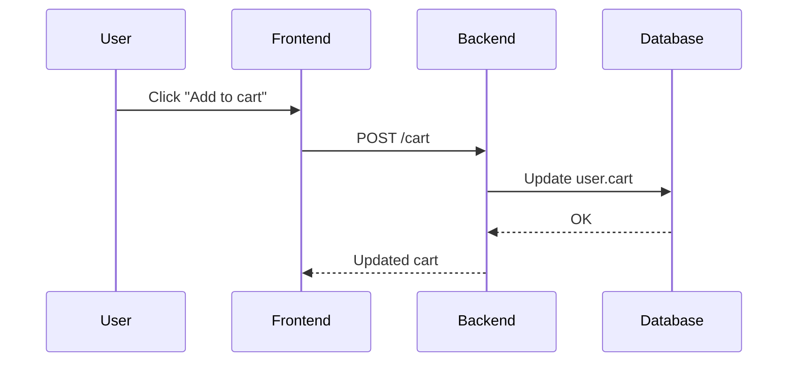
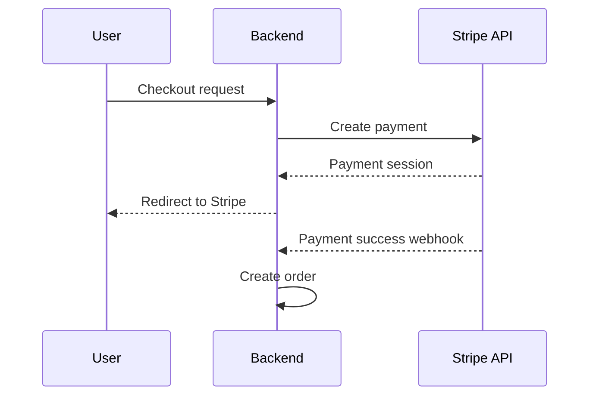

# 📦 README.md – Node.js Shopping Platform

## 🧭 Overview

This project is a full-stack **e-commerce web application** built with:

* Node.js (backend runtime)
* Express.js (web framework)
* MongoDB + Mongoose (database)
* EJS (templating engine)
* Stripe (payments)
* PDFKit (invoice generation)

The application supports a full shopping flow:

* Authentication (signup/login/reset password)
* Product management (CRUD)
* Shopping cart
* Orders & payments
* Invoice generation ([GitHub][1])

---

## 🖼️ System Overview (Architecture)



---

## 🧱 Application Architecture (Layered)



---

## 🗂️ Project Structure

```
.
├── controllers/
├── middleware/
├── models/
├── routes/
├── views/
├── public/
├── utils/
├── app.js
├── package.json
```

💡 Dette er en klassisk MVC-struktur:

* **Models** → database
* **Views** → UI
* **Controllers** → logikk

---

## 🧬 Data Model (MongoDB / Mongoose)



---

## 🔄 Key Flows

### 🛒 Add to Cart



---

### 💳 Checkout Flow (Stripe)



---

## ⚙️ Tech Stack (Tech Docs)

### Backend

| Technology | Purpose     |
| ---------- | ----------- |
| Node.js    | Runtime     |
| Express    | HTTP server |
| Mongoose   | ORM         |
| MongoDB    | Database    |

---

### Frontend

| Technology | Purpose               |
| ---------- | --------------------- |
| EJS        | Server-side rendering |
| CSS        | Styling               |

---

### Integrations

| Service | Purpose            |
| ------- | ------------------ |
| Stripe  | Payments           |
| PDFKit  | Invoice generation |

---

## 🔐 Security Considerations

* Password hashing (bcrypt)
* CSRF protection
* Input validation
* Secure session handling

---

## 🚀 Getting Started

```bash
git clone https://github.com/gaetanBloch/nodejs-shopping
cd nodejs-shopping
npm install
npm start
```

Open:

```
http://localhost:3000
```

---

## 🧠 Design Decisions

### Why Node.js?

* Non-blocking I/O → good for many concurrent users
* Event-driven architecture → scalable e-commerce backend

### Why MongoDB?

* Flexible schema → easy product modeling
* Good fit with JSON-based APIs

---

## 📈 Possible Improvements

### Architecture

* Split into microservices
* Introduce API layer (REST / GraphQL)

### Performance

* Redis caching (cart/session) ([Redis][2])
* CDN for images

### DevOps

* Dockerize app
* CI/CD pipeline

---

## 🧪 Testing Strategy

* Unit tests (controllers/services)
* Integration tests (API routes)
* End-to-end tests (checkout flow)

---

## 🧭 Roadmap

* [ ] Admin dashboard (analytics)
* [ ] Product search & filtering
* [ ] Wishlist feature
* [ ] Multi-tenant support
